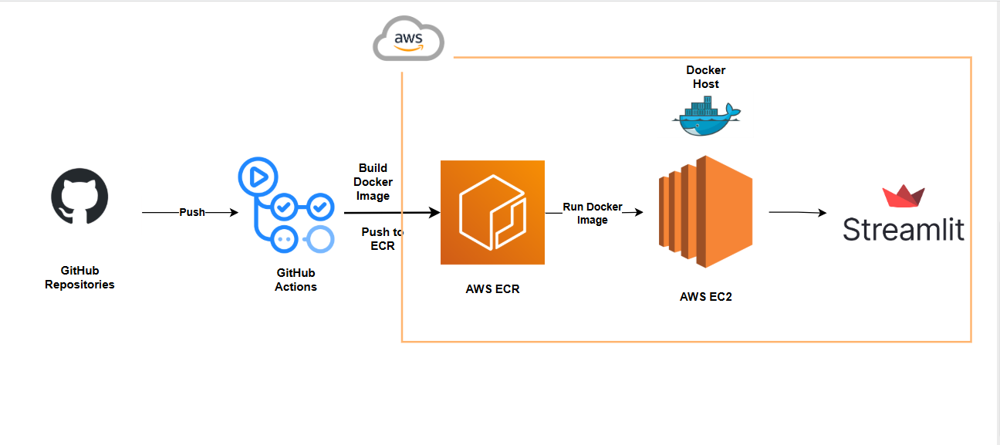

## RAG Medical Chatbot

This project consist on building an end-to-end Medical Chatbot using Generative AI. We’ll walk through every component—from integrating Large Language Models (LLMs) to using LangChain, Pinecone for vector search, and deploying it with Flask!

### RAG Architecture

- Python
- OpenAI API
- Flask
- Langchain
- Pinecone
- AWS

### Deployment Architecture

- Local : .env → dans .gitignore
- GitHub : secrets → GitHub Actions Secrets
- GitHub Actions : lit les secrets → les envoie à EC2
- EC2 : stocke la clé dans .env ou dans l’environnement système
- Ton code : lit la clé via os.getenv

